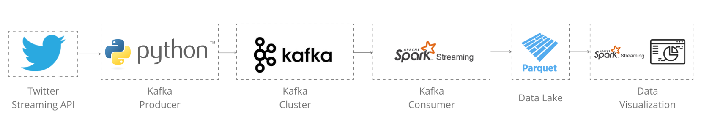

# Project: Twitter-Streaming-Kafka-PySpark

> by Filipe Macedo 06 July 2021

## 1. Project Description

The main objective of this project is to have the first contact with Apache Kafka, Spark Streaming and learn about the streaming process. To do this aproach I will use the twitter streaming API that allow developers to extract tweets in real time.

In the figure bellow you can see the arquitecture of the proposed solution.



## 2. Datasets

In this project just one dataset will be used:

```json
{
   "user_id" : 1374672061763887107,
   "user_name" : "Skyline Acade Writers",
   "verified" : false,
   "followers_count" : 307,
   "friends_count" : 1012,
   "user_created_at" : 1616593148,
   "tweet_id" : 1413953656370733059,
   "tweet_message" : "Looking for someone this weekend 
                       to do your
                       #Assignmentdue
                       #homework *
                       #python
                       #Onlineclass
                       #javascript
                       #math… https://t.co/TapmUUYQPE",
   "tweet_created_at" : 1625958596
}
```

