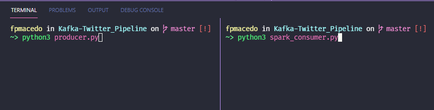
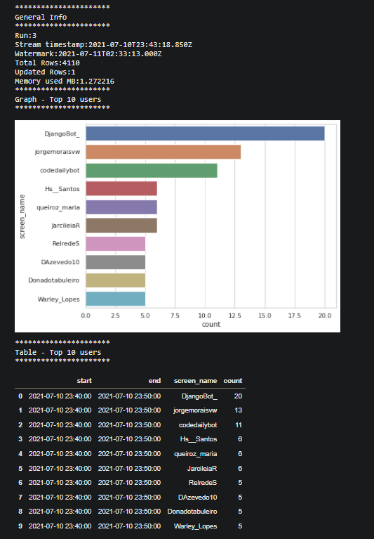
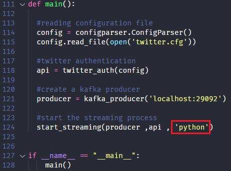

# Project: Twitter-Streaming-Kafka-PySpark

> by Filipe Macedo 06 July 2021

## 1. Project Description

The main objective of this project is to have the first contact with Apache Kafka, Spark Streaming and learn about the streaming process. To do this aproach I will use the twitter streaming API that allow developers to extract tweets in real time.

In the figure bellow you can see the arquitecture of the proposed solution.


## 2. Datasets

In this project just one dataset will be used, you can see the data description bellow:

```json
{
   "user_id" : 1127829883013361665,
   "user_name" : "xael bot",
   "screen_name": "xaelbot",
   "verified" : false,
   "followers_count" : 4819,
   "friends_count" : 1,
   "user_created_at" : 1557741372,
   "tweet_id" : 1414008496656470018,
   "tweet_message" : "RT @IainLJBrown: SCA invests in 
                      artificial intelligence company SourseAI - AdNews

                      Read more here: https://t.co/wc8bcyxWJi

                      #ArtificialInte…",
   "tweet_created_at" : 1625971671
}
```

## 3. Running The Streaming Pipeline

### 3.1 Clone the repository

Use git clone in your working folder to clone this repository.

### 3.2 Running Kafka and Zookeeper clusters

To start the streaming process we need a Kafka cluster, that will be controled by Zookeeper the responsable for manage cluster nodes, topics and partitions. To make easy to create our clusters Docker Compose will be used, I followed this [tutorial](https://www.baeldung.com/ops/kafka-docker-setup) to create our clusters, you just  need to run the command bellow:

```
docker-compose up -d
```
### 3.3 Creating Twitter Credentials

To connect twitter API an authentication token is necessary, you can find how to get your access to the API [here](https://developer.twitter.com/en/docs/twitter-api/getting-started/getting-access-to-the-twitter-api). After create your credentials you need to update the file ```twitter.cfg```, with your tokens as shown in the image below:

```
[CONSUMER]
CONSUMER_KEY = consumer key here
CONSUMER_SECRET = consumer secret here

[ACCESS]
ACCESS_TOKEN = access token here
ACCESS_TOKEN_SCRET = access token secret here

```

### 3.4 Start Kafka Producer and Kafka-Spark Consumer

In the terminal you need to run the following commands:

```python3 consumer.py``` and ```python3 spark_consumer.py```.

Terminal image example:




### 3.5 Streaming Data Visualization

To visualizate the number of collected tweets and the user names you have to open the notebook ```Twitter-Read-parquet.ipynb``` and run all cells. You will be able to see the statistics bellow:




### 3.6 Change the Search Keyword 

The producer is looking for tweets that contains the word ```python``` if you want to search tweets with another keyword open the ```producer.py``` and change the word python for any other of your preference.




